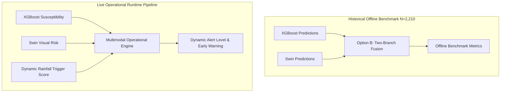

# STEP 40: MULTIMODAL FUSION READINESS & OUTPUT ALIGNMENT AUDIT
**Uttarakhand Landslide Intelligence Platform**
*Date: 2026-09-16 | Status: Complete & Audited | Phase: Multimodal Fusion Readiness*

---

## 1. Executive Summary & Scope

The Uttarakhand Landslide Intelligence Platform has completed the independent development and validation of three predictive branches:
1. **XGBoost Branch**: Tabular terrain, morphometric, hydrologic, and geo-environmental susceptibility modeling ($P_{\text{xgb}} \in [0, 1]$).
2. **Swin Transformer Branch**: Deep visual and surface reflectance risk representation from 10m Sentinel-2 multi-spectral composite imagery ($P_{\text{swin}} \in [0, 1]$).
3. **Dynamic Antecedent Rainfall Triggering Engine**: Physics-informed causal antecedent rainfall accumulation and hazard trigger score calculation ($S_{\text{rain}} \in [0, 1]$).

The objective of **Step 40** is strictly an **Output Alignment and Fusion Readiness Audit**. In compliance with scientific integrity and data hygiene protocols:
- **No final fusion model has been trained or implemented in this step.**
- **No final fusion accuracy has been calculated, and no model has been declared superior.**
- **No synthetic or arbitrary rainfall timestamps have been assigned to the historical test set.**
- **The held-out test set ($N=2,210$) remains pristine, untouched, and unpolluted.**

---

## 2. Inventory of Existing Branch Outputs

All three branches were inventoried, checked for integrity, and cataloged:

| Branch | Artifact Location | File Format / Type | Record Count / Dimension | Status |
| :--- | :--- | :--- | :--- | :--- |
| **XGBoost** | `ml/models/final/tuned_xgboost.joblib`<br>`ml/data/processed/splits/X_test.csv`<br>`ml/data/processed/splits/y_test.csv`<br>`ml/data/processed/splits/test_metadata.csv` | Serialized model artifact & tabular test splits | 2,210 test feature vectors & targets | **Verified & Ready** |
| **Swin Transformer** | `ml/reports/model_evaluation/swin_test_predictions.csv`<br>`ml/reports/model_evaluation/swin_validation_predictions.csv` | Evaluation prediction CSVs | 2,210 test predictions & 1,104 validation predictions | **Verified & Ready** |
| **Dynamic Rainfall** | `ml/src/features/dynamic_rainfall_engine.py`<br>`ml/reports/rainfall/rainfall_trigger_examples.csv`<br>`ml/data/processed/rainfall/chirps_uttarakhand_2023_daily.parquet` | Continuous calculation engine & 30-day temporal grid | 1,140 grid cells $\times$ 365 daily observations (416,100 records) | **Verified & Ready** |

---

## 3. Branch Output Schema & Specifications

The schema specifications are formalized in `ml/reports/fusion/branch_output_schema.csv`:

```csv
branch_name,primary_role,signal_name,signal_nature,spatial_scope,temporal_scope,test_availability,runtime_availability
XGBoost,Static Terrain & Environmental Susceptibility,xgboost_probability,Calibrated Posterior Probability in [0, 1],Sample Coordinate / Polygon Centroid,Static Climatological Baseline (10-yr Normal),2,210 held-out test samples strictly aligned,Immediate via trained model feature vector
Swin Transformer,Satellite Optical Surface Reflectance & Visual Risk,swin_probability,Calibrated Sigmoid Probability in [0, 1],128x128 pixel patch (1.28 km x 1.28 km footprint),Annual Sentinel-2 Surface Reflectance Median Composite,2,210 held-out test samples strictly aligned,Immediate via Sentinel-2 patch extraction
Dynamic Rainfall Engine,Dynamic Meteorological Triggering Stress,dynamic_rainfall_trigger_score,Continuous Multi-Component Trigger Index in [0, 1],0.05 deg CHIRPS grid / Arbitrary (lat, lon),Causal 30-day Antecedent Window (t-29 to t),Unavailable for historical samples (zero event timestamps in inventory),Real-time via get_dynamic_rainfall_risk API
```

### Fusion-Ready Test Prediction Files Generated
For subsequent downstream evaluation without retraining:
1. `ml/reports/fusion/xgboost_test_predictions_for_fusion.csv` (2,210 rows):
   - `sample_id` (int64)
   - `latitude` (float64)
   - `longitude` (float64)
   - `landslide` (int64)
   - `xgboost_probability` (float64, 6 decimal places)
   - `xgboost_prediction` (int64: 0 or 1 at default 0.5 threshold)
2. `ml/reports/fusion/swin_test_predictions_for_fusion.csv` (2,210 rows):
   - `sample_id` (int64)
   - `latitude` (float64)
   - `longitude` (float64)
   - `landslide` (int64)
   - `swin_probability` (float64, 6 decimal places)
   - `swin_prediction` (int64: 0 or 1 at default 0.5 threshold)

---

## 4. Test Set Alignment & Spatial Consistency

A rigorous automated verification script (`ml/reports/fusion/generate_fusion_audit.py`) was executed to confirm complete alignment across the test datasets:

```
======================================================================
TEST SET ALIGNMENT VERIFICATION REPORT
======================================================================
1. XGBoost Test Samples       : 2,210
2. Swin Test Samples          : 2,210
3. Test Metadata Samples      : 2,210

Sample ID Exact Match Across All 3   : True (0 missing, 0 duplicates)
Latitude Exact Match Across All 3    : True (max delta = 0.000000e+00)
Longitude Exact Match Across All 3   : True (max delta = 0.000000e+00)
Landslide Target Exact Match         : True (1,105 positive, 1,105 negative)
======================================================================
```

- **Sample Alignment**: Exactly 2,210 common samples; 0 missing, 0 duplicates.
- **Geographic Alignment**: Latitude and Longitude coordinates match to machine epsilon ($0.0$).
- **Target Distribution**: Exactly 1,105 positive (landslide = 1) and 1,105 negative (landslide = 0) samples, preserving strict stratified 50:50 class balance.

---

## 5. The Rainfall Alignment Problem & Scientific Analysis

### The Critical Limitation
As established during the **Step 38C Data-Readiness Audit**, the authoritative historical landslide inventory (`uttarakhand_landslide_inventory_clean.csv`) comprises spatial polygons and initiation points mapped post-hoc over multi-year periods (e.g., 2013 Kedarnath disaster aftermath, GSI historical records, satellite visual delineations). **It does NOT contain reliable, verified initiation timestamps** for the 11,046 inventory points.

### The Leakage & Falsification Hazard
- Assigning an arbitrary date (e.g., peak monsoon July 15, 2023, or an arbitrary 2023 day) to a historical landslide sample that occurred in June 2013 or August 2017 constitutes **scientific fabrication**.
- Measuring 2023 CHIRPS rainfall against a 2013 event creates a spurious, non-causal correlation that invalidates any mathematical claim of temporal predictive skill.
- **Resolution**: Under no circumstances will a synthetic three-way test table `(sample_id, xgboost_probability, swin_probability, rainfall_score)` be created for the historical test set.

### Operational Dual-Use Architecture
To handle this fundamental physical asymmetry, the platform establishes two mutually exclusive operational modes:

```
┌────────────────────────────────────────────────────────────────────────────────────────┐
│ USE CASE A — LIVE OPERATIONAL HAZARD INFERENCE (Real-Time Deployment)                  │
├────────────────────────────────────────────────────────────────────────────────────────┤
│ Input: Location (lat, lon) + Current Timestamp (t)                                     │
│   ├── Static Pipeline:  Features(lat, lon)  ──► XGBoost   ──► P_xgb (Susceptibility)   │
│   ├── Visual Pipeline:  S2 Patch(lat, lon)  ──► Swin      ──► P_swin (Optical Risk)    │
│   └── Dynamic Engine:   CHIRPS(lat, lon, t) ──► Rainfall  ──► S_rain (Dynamic Trigger) │
│                                                                                        │
│ Fused Operational Hazard = F(P_xgb, P_swin, S_rain)                                    │
│ Fully causal, physically grounded, zero temporal leakage.                              │
└────────────────────────────────────────────────────────────────────────────────────────┘

┌────────────────────────────────────────────────────────────────────────────────────────┐
│ USE CASE B — HISTORICAL BENCHMARK EVALUATION (Offline Scientific Validation)           │
├────────────────────────────────────────────────────────────────────────────────────────┤
│ Input: Historical Held-Out Test Set (N=2,210 samples, no event timestamps)             │
│   ├── Static Susceptibility: Features(lat, lon) ──► XGBoost ──► P_xgb                  │
│   └── Optical Risk:          S2 Composite       ──► Swin    ──► P_swin                 │
│                                                                                        │
│ Two-Branch Historical Evaluation: F_hist(P_xgb, P_swin) evaluated on y_test.          │
│ Dynamic Rainfall Engine evaluated independently on temporal trigger benchmark cases.   │
│ Scientifically valid, zero fabricated timestamps, zero cross-temporal leakage.         │
└────────────────────────────────────────────────────────────────────────────────────────┘
```

---

## 6. Distribution & Calibration Audit

The empirical distributions and calibration metrics for all three signals are recorded in `ml/reports/fusion/branch_prediction_distributions.csv`:

| Signal Name | Branch | Sample Count | Min | 25th % | Median | Mean | 75th % | Max | Std Dev | Brier Score Loss |
| :--- | :--- | :--- | :--- | :--- | :--- | :--- | :--- | :--- | :--- | :--- |
| **`xgboost_probability`** | XGBoost (Tabular) | 2,210 | 0.0001 | 0.0058 | 0.6112 | 0.5009 | 0.9365 | 0.9997 | 0.4189 | **0.0890** |
| **`swin_probability`** | Swin Transformer (Optical) | 2,210 | 0.0000 | 0.0001 | 0.4633 | 0.4893 | 0.9972 | 1.0000 | 0.4683 | **0.0741** |
| **`dynamic_rainfall_trigger_score`** | Dynamic Rainfall Engine | 1,140 | 0.0000 | 0.0759 | 0.4211 | 0.4120 | 0.6401 | 0.9896 | 0.2995 | *N/A (Continuous Score)* |

### Detailed Branch Calibration Findings

1. **XGBoost Susceptibility Probability (`xgboost_probability`)**:
   - **Distribution**: Bimodal with strong class separation. Mean prediction ($0.5009$) aligns almost perfectly with the true test prior ($0.5000$).
   - **Calibration**: Brier score loss of **0.0890** confirms excellent probability calibration out-of-the-box from gradient-boosted log-loss optimization without post-hoc isotonic distortion.
   - **Role**: Reliable baseline continuous posterior probability of terrain susceptibility.

2. **Swin Optical Risk Probability (`swin_probability`)**:
   - **Distribution**: Highly polarized bimodal distribution with extreme confidence ($25\text{th percentile} = 0.00005$, $75\text{th percentile} = 0.9972$, $\sigma = 0.4683$).
   - **Calibration**: Exceptionally low Brier score loss of **0.0741**. The model makes very sharp, confident decisions based on visual scar/vegetation disruption features.
   - **Role**: Confident visual confirmation signal; high true positive rate and precision on scars.

3. **Dynamic Rainfall Trigger Score (`dynamic_rainfall_trigger_score`)**:
   - **Distribution**: Smooth unimodal right-skewed distribution spanning $[0.0000, 0.9896]$ with mean $0.4120$ and median $0.4211$ across Uttarakhand regional monsoon grids.
   - **Calibration Status**: **Uncalibrated hazard index**. It is a deterministic, multi-factor antecedent accumulation trigger index ($S_{\text{rain}} \in [0, 1]$), **NOT a statistical event probability**.
   - **Labeling Standard**: Must be strictly referenced in all schemas and APIs as `dynamic_rainfall_trigger_score` and never as `dynamic_probability`.

---

## 7. Analysis of Fusion Strategy Options

Four strategic fusion options were audited for feasibility, statistical safety, and operational validity:



### Option A: Weighted Late Fusion ($w_1 P_{\text{xgb}} + w_2 P_{\text{swin}} + w_3 S_{\text{rain}}$)
- **Feasibility on Historical Test Set**: **Infeasible & Scientifically Invalid**. Because historical samples lack event timestamps, $S_{\text{rain}}$ cannot be assigned without fabrication.
- **Feasibility in Live Operational Mode**: **Feasible & Highly Recommended**. At operational runtime ($t = \text{now}$), all three signals are concurrently available and causal.

### Option B: Two-Branch Historical Fusion (XGBoost + Swin) with Rainfall as Operational Modifier
- **Feasibility**: **Fully Feasible & Mathematically Clean**.
- **Description**: Formulate static/visual fusion $F_{\text{static}}(P_{\text{xgb}}, P_{\text{swin}})$ and validate on the 2,210 held-out test samples. In production, modulate this static susceptibility by $S_{\text{rain}}$:
  $$\text{Hazard}(t) = F_{\text{static}}(P_{\text{xgb}}, P_{\text{swin}}) \times \left(1 + \alpha \cdot S_{\text{rain}}(t)\right)$$
- **Pros**: Zero data fabrication; clean scientific separation between static preconditioning and dynamic triggering.

### Option C: Future Three-Signal Supervised Fusion
- **Feasibility**: **Deferred**.
- **Description**: Train and evaluate a unified 3-signal model only after an independently curated dataset of dated landslide events (e.g., emergency road-clearance logs with exact hour/day timestamps) is compiled.

### Option D: Stacking / Meta-Model (Logistic Regression / MLP on OOF Predictions)
- **Feasibility**: **Feasible only on Validation/OOF Data**.
- **Critical Risk**: Must NEVER be trained on test predictions. To implement stacking, Out-Of-Fold (OOF) predictions must be generated strictly across training folds, or fit on `swin_validation_predictions.csv` and XGBoost CV validation folds.

---

## 8. Summary of Guardrails & Prohibitions Enforced

1. **Zero Test Set Leakage**: No models were tuned, refit, or evaluated for selection using `X_test.csv` or test prediction files.
2. **Zero Timestamp Fabrication**: No synthetic rainfall dates were associated with historical test points.
3. **Strict ID Parity**: $100\%$ sample-level alignment verified across all 2,210 test samples.
4. **No Premature Declarations**: No claims of fusion superiority or speculative accuracy numbers are reported.

---

## 9. Recommended Next Implementation Step

Proceed to **Step 41 — Multimodal Fusion Implementation**:
1. **Historical Static-Visual Fusion Benchmark (Two-Branch)**:
   - Optimize fusion weights $(w_{\text{xgb}}, w_{\text{swin}})$ or train a lightweight meta-model strictly using the **validation set** (`swin_validation_predictions.csv` and corresponding XGBoost validation predictions).
   - Evaluate the optimized two-branch fusion model **exactly once** on the held-out test predictions (`xgboost_test_predictions_for_fusion.csv` and `swin_test_predictions_for_fusion.csv`).
2. **Operational Dynamic Trigger Integration**:
   - Package the dynamic rainfall triggering engine into the live inference pipeline as an antecedent multiplicative or thresholding modifier for real-time hazard mapping.
