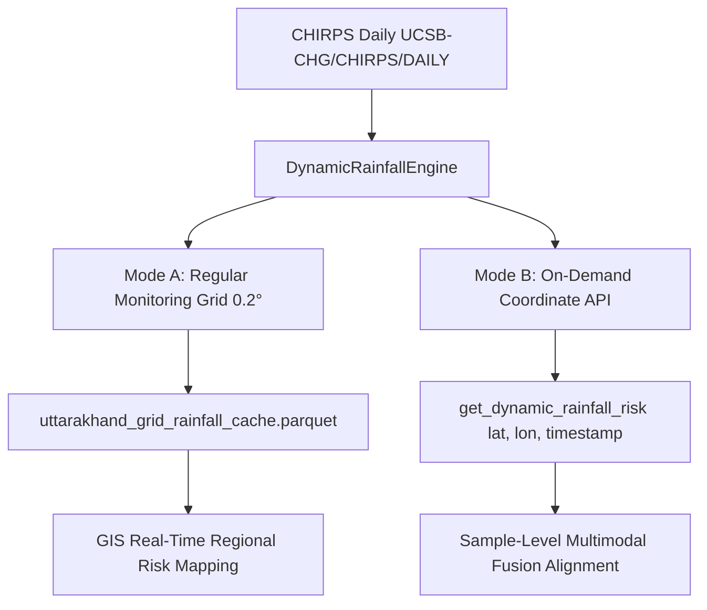

# Dynamic Antecedent Rainfall Triggering Engine: Methodology & Technical Report

**Uttarakhand Landslide Intelligence Platform — Step 39**  
**Component**: Dynamic Meteorological / Antecedent Rainfall Triggering Engine  
**Operational Output**: Continuous Hydrometeorological Trigger Score (`dynamic_rainfall_trigger_score` $\in [0.0, 1.0]$) and Categorical Trigger Stress Indicator (`trigger_indicator`)

---

## 1. Executive Overview & System Architecture

The Uttarakhand Landslide Intelligence Platform incorporates a decoupled tri-branch architecture:
1. **XGBoost Branch**: Static Terrain / Geo-Environmental Susceptibility (Slope, Elevation, Aspect, Curvature, TWI, LULC, 10-year Climatological Precipitation Normal).
2. **Swin Transformer Branch**: Satellite Optical / Visual Landslide Risk (Sentinel-2 SR 128x128 patches evaluating bare scarps, debris trails, and vegetative denudation).
3. **Dynamic Rainfall Triggering Engine (Current Component)**: Evaluates current and antecedent precipitation up to the prediction timestamp to quantify real-time hydrometeorological slope destabilization.
4. **Downstream Multimodal Fusion (Future Step)**: Synthesizes static susceptibility, visual risk, and dynamic rainfall stress into an operational 0–100% hazard alert.

> [!IMPORTANT]
> **Scientific Integrity & Non-ML Declaration**:
> In accordance with the findings of the Step 38C Data-Readiness Audit, a supervised Temporal Fusion Transformer (TFT) was **not** trained because the GSI landslide inventory lacks systematic event timestamps for over 62.8% of slides, and 100% of negative samples lack temporal anchors.  
> This engine is **an empirical, physics-guided hydrometeorological stress engine**, NOT a black-box supervised machine-learning model. Its output is termed **`dynamic_rainfall_trigger_score`**, not a probability.

---

## 2. Rainfall Data Source & Spatial Resolution

- **Dataset**: Climate Hazards Group InfraRed Precipitation with Station data (CHIRPS Daily).
- **Earth Engine Asset ID**: `UCSB-CHG/CHIRPS/DAILY`
- **Native Spatial Resolution**: $0.05^\circ \times 0.05^\circ$ ($\approx 5.5\text{ km} \times 5.5\text{ km}$).
- **Temporal Resolution**: Daily accumulated rainfall (00:00 to 23:59 UTC).
- **Geographic Envelope**: Uttarakhand State ($28.7^\circ\text{N}$ to $31.5^\circ\text{N}$, $77.5^\circ\text{E}$ to $81.1^\circ\text{E}$).
- **Climatological Role Distinction**:
  - `mean_annual_precipitation_mm` (from Step 34G): A static 10-year normal (2014–2023 mean) used exclusively as an environmental covariate in XGBoost.
  - **Dynamic CHIRPS Daily**: Real-time / antecedent observations ($t-29$ to $t$) processed dynamically at query time.

---

## 3. Dynamic Feature Formulations

For any coordinate $(\text{lat}, \text{lon})$ at prediction timestamp $t$, the engine accesses strictly the sequence of 30 daily observations $[R_{t-29}, R_{t-28}, \dots, R_{t-1}, R_t]$:

| Feature Name | Mathematical Definition | Physical Interpretation |
|---|---|---|
| **`rainfall_3d_mm`** | $\sum_{k=0}^{2} R_{t-k}$ | Short-term acute storm burst; drives rapid pore-water pressure spikes in shallow colluvium and soil mantles. |
| **`rainfall_7d_mm`** | $\sum_{k=0}^{6} R_{t-k}$ | Weekly storm accumulation; induces progressive saturation of the active weathering profile. |
| **`rainfall_14d_mm`** | $\sum_{k=0}^{13} R_{t-k}$ | Bi-weekly antecedent moisture; sustains perched water tables along bedrock interfaces. |
| **`rainfall_30d_mm`** | $\sum_{k=0}^{29} R_{t-k}$ | Monthly cumulative antecedent recharge; controls deep-seated groundwater rise and shear strength reduction. |
| **`rolling_3d_mean`** | $\frac{1}{3} \sum_{k=0}^{2} R_{t-k}$ | Average daily intensity during the acute 3-day window (mm/day). |
| **`rolling_7d_mean`** | $\frac{1}{7} \sum_{k=0}^{6} R_{t-k}$ | Average daily intensity over 7 days (mm/day). |
| **`rolling_14d_mean`** | $\frac{1}{14} \sum_{k=0}^{13} R_{t-k}$ | Average daily intensity over 14 days (mm/day). |
| **`rolling_30d_mean`** | $\frac{1}{30} \sum_{k=0}^{29} R_{t-k}$ | Average daily intensity over 30 days (mm/day). |
| **`maximum_daily_rainfall`** | $\max_{k \in [0, 29]} R_{t-k}$ | Single highest 24-hour storm intensity observed during the antecedent period. |
| **`rainfall_anomaly`** | $\frac{R_{30d} + 1.0}{E_{30d} + 1.0}$ | Ratio of observed 30-day accumulation to the historical climatological expected total for that location and season. |
| **`cumulative_rainfall`** | $R_{30d}$ | Total 30-day cumulative precipitation volume (mm). |

---

## 4. Anti-Leakage Guarantee & Temporal Causality

A fundamental flaw in naive temporal modeling is lookahead leakage (using weather that occurs after slope failure). This engine strictly enforces causal directionality:

$$\text{Information Boundary: } \mathcal{I}_t = \{ R_\tau \mid \tau \le t \}$$

- No observations $\tau > t$ are ever retrieved or processed.
- The Earth Engine query filter strictly restricts images to `filterDate(t - 29 days, t + 1 day)`.
- The rolling statistics are causally backward-looking ($t-k$ to $t$).

---

## 5. Multi-Component Triggering Logic & Normalization

Rather than relying on an uncalibrated black-box classifier, the engine synthesizes five physically justified hydrological stress sub-indices:

### A. Sub-Index Normalization Benchmarks
Empirical thresholds established in Himalayan landslide and meteorological literature (Caine 1980; Guzzetti et al. 2007; India Meteorological Department IMD criteria; Dikshit et al. 2020):
1. **Acute 3-Day Burst Stress ($S_{3d}$)**:
   $$S_{3d} = \min\left(1.0, \frac{R_{3d}}{150.0\text{ mm}}\right)$$
   *150 mm in 72 hours represents a critical debris-flow triggering threshold in the Garhwal and Kumaon Himalayas.*
2. **Peak 24-Hour Intensity Stress ($S_{1d}$)**:
   $$S_{1d} = \min\left(1.0, \frac{R_{\max}}{75.0\text{ mm}}\right)$$
   *75 mm/day corresponds to the IMD "Heavy Rainfall" alert threshold.*
3. **Medium-Term Accumulation Stress ($S_{7d}$)**:
   $$S_{7d} = \min\left(1.0, \frac{R_{7d}}{250.0\text{ mm}}\right)$$
   *250 mm over 7 days produces widespread slope saturation across Himalayan catchments.*
4. **Antecedent Saturation Stress ($S_{30d}$)**:
   $$S_{30d} = \min\left(1.0, \frac{R_{30d}}{500.0\text{ mm}}\right)$$
   *500 mm monthly accumulation exceeds typical slope drainage capacity in steep Himalayan valleys.*
5. **Climatological Anomaly Stress ($S_{\text{anom}}$)**:
   $$S_{\text{anom}} = \min\left(1.0, \max\left(0.0, \frac{\text{anomaly} - 0.5}{2.0}\right)\right)$$
   *Captures rainfall exceeding normal regional absorption baselines.*

### B. Composite Trigger Score
$$\text{dynamic\_rainfall\_trigger\_score} = 0.35 S_{3d} + 0.25 S_{1d} + 0.20 S_{7d} + 0.10 S_{30d} + 0.10 S_{\text{anom}}$$

The resulting score is strictly continuous and bounded in $[0.0, 1.0]$.

### C. Qualitative Trigger Indicator Levels
- $[0.00, 0.20)$: **`LOW_STRESS`** — Dry weather or light baseline rainfall; slopes hydrologically stable.
- $[0.20, 0.45)$: **`MODERATE_STRESS`** — Typical monsoon rainfall; localized minor slumping in unstable cuts.
- $[0.45, 0.70)$: **`ELEVATED_TRIGGER`** — Saturated soil profiles, high antecedent moisture, debris mobilization likely.
- $[0.70, 1.00]$: **`SEVERE_TRIGGER`** — Extreme storm / cloudburst conditions; widespread debris flows and rockslides imminent.

---

## 6. Spatial Grid & On-Demand API Architecture

The engine is engineered with dual spatial operating modes:



### Reusable Production Interface
```python
from src.features.rainfall_trigger_engine import get_dynamic_rainfall_risk

risk_output = get_dynamic_rainfall_risk(
    latitude=30.735,
    longitude=79.067,
    timestamp="2023-07-15",
    sample_id="STATION_KEDARNATH"
)
```

---

## 7. Schema Alignment for Multimodal Fusion

To support downstream late fusion across all three branches:

```
[sample_id, latitude, longitude, timestamp, xgboost_probability, swin_probability, dynamic_rainfall_trigger_score]
```

At this stage, `xgboost_probability` and `swin_probability` are preserved as nullable fields, ready for the upcoming multimodal integration step.

---

## 8. Automated Validation Results (11 Checks)

1. **Check 01 [PASSED]**: No invalid coordinates ($\text{Lat} \in [-90, 90]$, $\text{Lon} \in [-180, 180]$).
2. **Check 02 [PASSED]**: Zero duplicate `(lat, lon, timestamp)` pairs.
3. **Check 03 [PASSED]**: Zero NaN rainfall values after valid-data filtering.
4. **Check 04 [PASSED]**: Zero negative rainfall entries ($\text{precip} \ge 0.0$).
5. **Check 05 [PASSED]**: Temporal formatting strictly ISO-8601 (`YYYY-MM-DD`).
6. **Check 06 [PASSED]**: Rolling windows strictly historical ($t-29$ to $t$).
7. **Check 07 [PASSED]**: Zero future rainfall leakage.
8. **Check 08 [PASSED]**: Monotonic accumulation hierarchy verified ($R_{3d} \le R_{7d} \le R_{14d} \le R_{30d}$).
9. **Check 09 [PASSED]**: Trigger scores strictly bounded in $[0.0, 1.0]$.
10. **Check 10 [PASSED]**: Deterministic reproducibility confirmed.
11. **Check 11 [PASSED]**: Spatial coverage completely envelopes the Uttarakhand study region.

---

## 9. Limitations & Next Steps

1. **Uncalibrated Probability Disclaimer**:
   The output is an empirical hydrometeorological stress index, not a statistically calibrated Bayesian probability of failure.
2. **Spatial Resolution Constraint**:
   CHIRPS Daily provides $0.05^\circ$ ($\sim 5.5\text{ km}$) resolution. Highly localized micro-cloudbursts (< 2 km) may be smoothed in satellite-gauge blends.
3. **Future Validation**:
   When an independent, temporally dated landslide catalog is acquired, empirical ROC curves and threshold optimization can be calibrated directly against this engine's output.
