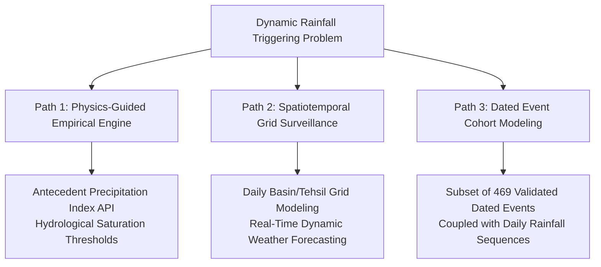

# Step 38C: Temporal Fusion Transformer (TFT) Data-Readiness Audit

**Uttarakhand Landslide Intelligence Platform — Temporal Risk Branch**  
**Component**: Dynamic Meteorological / Temporal Triggering Risk Branch (TFT)  
**Audit Objective**: Assess whether the existing landslide inventory and meteorological data contain sufficient temporal information to construct a scientifically valid supervised temporal landslide-risk prediction model.

---

## 1. Executive Summary & Readiness Verdict

### **Readiness Verdict**: **NOT READY** (for supervised point-based TFT training on the current dataset)

> [!CAUTION]
> **Scientific Integrity & Anti-Leakage Protocol**:  
> A supervised Temporal Fusion Transformer (TFT) requires time-stamped target events ($Y_{i,t} \in \{0, 1\}$) paired with strictly antecedent dynamic covariates ($X_{i, t-k : t-1}$). Training a supervised TFT on the existing master dataset is **scientifically invalid** at this stage because:
> 1. **Over 62.8% of positive landslide records have no temporal information whatsoever** (completely null/missing).
> 2. **74.6% of the remaining records contain only a coarse calendar year** (e.g., "2014"), which cannot resolve rainfall triggers operating at hourly or daily timescales.
> 3. **100% of negative samples (5,523 spatial points) possess zero temporal timestamps**, making supervised negative sequence assignment impossible without fabricating dates.
> 4. Assigning arbitrary dates or training on unanchored rainfall sequences introduces severe **temporal leakage, reverse causality, and synthetic bias**.

---

## 2. Inventory Audit: Potential Temporal Fields Discovered

An exhaustive audit of [uttarakhand_landslide_inventory_clean.csv](file:///c:/Users/hp/OneDrive/Desktop/Landslide/landslide-platform/ml/data/processed/uttarakhand_landslide_inventory_clean.csv) and [uttarakhand_master_ml_dataset.csv](file:///c:/Users/hp/OneDrive/Desktop/Landslide/landslide-platform/ml/data/processed/uttarakhand_master_ml_dataset.csv) was conducted:

| Field Name | Source Dataset | Data Type | Total Samples | Non-Null Count | Missing (%) | Unique Values | Temporal Semantics |
|---|---|---|---|---|---|---|---|
| **`history`** | Clean Inventory | `object` | 5,523 | 2,053 | **62.83%** | 185 | Qualitative field survey notes; coarse years and occasional date strings. |
| **`slide_no`** | Clean Inventory | `object` | 5,523 | 5,522 | **0.02%** | 5,518 | Administrative GSI Field Season Programme (FSP) campaign year; observation time, **not** event time. |
| **`landslide_date`** | Master ML Dataset | *None* | 11,046 | 0 | **100.0%** | 0 | Non-existent in master ML dataset or split metadata. |
| **`negative_timestamp`** | Negative Dataset | *None* | 5,523 | 0 | **100.0%** | 0 | Negative samples are purely static spatial background coordinates (>2 km from slides). |

---

## 3. Deep Analysis of Discovered Fields

### A. The `history` Field
The `history` field was extracted from Column 10 of the Geological Survey of India (GSI) Bhusanket inventory PDF tables (`landslide_report.pdf`):
- **Missingness**: Out of 5,523 positive landslide records, **3,470 (62.83%) are completely null (`NaN`)**.
- **Categorization of the 2,053 Present Records**:
  - **Coarse Year Only (1,532 records, 74.62% of present, 27.74% of total)**:
    - Values such as `2014` (265), `2013` (242), `2018` (198), `2011` (186), `2016` (155), `2012` (135), `2017` (100), `2015` (57), `2010` (53), `2006` (26).
    - These indicate only that a landslide was active or observed in a given calendar year. They contain no month, day, or time of day.
  - **Specific Date or Date Range (469 records, 22.84% of present, 8.49% of total)**:
    - **263 of these 469 records (56.08%)** are the single catastrophic Kedarnath flash flood disaster (`16th-17th June 2013`).
    - The remaining ~206 records (< 3.8% of the inventory) are scattered across various storm dates (e.g., `30 June, 2016`, `15th-16th September 2025` [likely a reporting typo for 2015]).
  - **Month + Year Only (28 records, 1.36% of present, 0.51% of total)**:
    - E.g., `August 2023` (18), `July 2023` (5).
  - **Descriptive Text (24 records, 1.17% of present, 0.43% of total)**:
    - E.g., `Last week of July, 2014.`, `July 2023 retriggered`, `2003, 2013, 2017 and 2018.`.

### B. The `slide_no` Field
The slide identification number adheres to the GSI National Landslide Susceptibility Mapping (NLSM) coding convention:
$$\text{Code Format: } \texttt{State / District / Toposheet / FSP\_Campaign\_Year / Serial}$$
*(e.g., `UK/CHA/62C04/2017/34`)*
- **Distribution of Embedded Years**: 2015 (3,051), 2016 (668), 2017 (614), 2018 (520), 2013 (268), 2020 (72), 2023 (51), 2025 (106).
- **Semantics**: This year denotes the **Field Season Programme (FSP) survey year** during which GSI geologists mapped the feature, **not the initiation time of the slope failure**.
- **Proof of Discrepancy**:
  - `UK/CHA/62C04/2017/34` $\rightarrow$ FSP Campaign: `2017` | Landslide History: `2014`
  - `UK/CHA/62C04/2017/24` $\rightarrow$ FSP Campaign: `2017` | Landslide History: `2012`
  - `UK/CHA/62C04/2017/12` $\rightarrow$ FSP Campaign: `2017` | Landslide History: `2006`
  Using `slide_no` year as an event date would assign rainfall events 3 to 11 years after the landslide occurred.

---

## 4. Feasibility Classification: CASE D

Among the standard diagnostic situations:
- **CASE A**: Reliable landslide event dates exist for a substantial portion of positive samples. *(Does NOT apply — only 8.49% have dates, predominantly a single event).*
- **CASE B**: Only approximate years/months exist. *(Applies to ~28% of positives, but fails entirely for the 63% missing and 100% of negatives).*
- **CASE C**: Inventory/observation dates exist but actual event dates do not. *(Applies to `slide_no` FSP campaign year).*
- **CASE D**: **No meaningful temporal labels exist across the unified dataset.**

> [!IMPORTANT]
> **Verdict: CASE D applies.**  
> When considering the unified dataset of 11,046 samples (5,523 positive and 5,523 negative), exactly **0 negative samples** and **only 469 positive samples (4.2% of the combined dataset)** possess date-level timestamps. Supervised temporal classification cannot be formulated on this dataset without fabricating labels.

---

## 5. Rainfall Data Readiness & Local Storage Audit

- **Step 34G Feature**: `mean_annual_precipitation_mm` was extracted from Google Earth Engine asset `UCSB-CHG/CHIRPS/DAILY`.
- **Local Storage State**:
  - Only the **10-year scalar climatological normal** (2014–2023 mean annual total) is stored in `ml/data/processed/features/uttarakhand_ml_precipitation_features.csv`.
  - **Zero daily rainfall time series** (e.g., $t-30, \dots, t-1$) are stored locally.
- **Acquisition Feasibility**: While CHIRPS Daily or ERA5-Land precipitation could be queried via Earth Engine, extracting daily antecedent sequences without known event timestamps ($t$) is impossible because the reference anchor $t$ does not exist.

---

## 6. Critical Temporal Leakage & Reverse Causality Analysis

A supervised Temporal Fusion Transformer learns mapping:
$$[R_{i, t-30}, R_{i, t-29}, \dots, R_{i, t-1}, R_{i, t}] \longrightarrow Y_{i, t} \in \{0, 1\}$$

If forced onto the existing dataset, three catastrophic leakage mechanisms emerge:

1. **Post-Event Rainfall Leakage (Lookahead Leakage)**:
   - For the 1,532 samples with year-only information (e.g., "2014"), if annual or monsoon rainfall for 2014 is used, rainfall occurring in August/September 2014 would be used to "predict" a landslide that may have occurred in June 2014.
2. **Reverse Causality / Decoupled Climatology**:
   - For the 3,470 positive samples missing history, using an arbitrary contemporary rainfall window (e.g., 2023 CHIRPS data) feeds 2023 weather into a model to predict a landslide that occurred a decade earlier (e.g., 2013).
3. **Synthetic Negative Temporal Bias**:
   - Assigning arbitrary "quiescent" dates to pseudo-negative background samples teaches the network an artificial correlation between weather on arbitrarily chosen days and slope stability, destroying generalization.

---

## 7. Split Compatibility & Multimodal Fusion Constraints

- **Split Metadata**: `train_metadata.csv` (8,836 samples) and `test_metadata.csv` (2,210 samples) contain strictly: `[sample_id, latitude, longitude, landslide]`.
- **Temporal Alignment**:
  - In Train: 2,783 of 4,418 positives (62.99%) are missing history; 4,418 negatives (100%) have no timestamp.
  - In Test: 687 of 1,105 positives (62.17%) are missing history; 1,105 negatives (100%) have no timestamp.
- **Fusion Alignment**: The final tri-branch fusion architecture requires:
  $$\hat{Y}_{\text{fusion}} = \mathcal{F}(P_{\text{XGBoost}}(\text{Terrain}), P_{\text{Swin}}(\text{Visual}), P_{\text{TFT}}(\text{Dynamic Temporal}))$$
  aligned strictly by `sample_id`. A model trained on a small, non-representative temporal subset cannot produce valid predictions for the remaining 95%+ of samples in `test_metadata.csv`.

---

## 8. Potential Methodological Paths Forward for Dynamic Risk

To incorporate dynamic meteorological triggering into the Uttarakhand Landslide Intelligence Platform without compromising scientific rigor, three options exist:

1. **Path 1: Empirical Antecedent Rainfall / Hydrological Saturation Engine (Recommended for Tri-Branch Fusion)**:
   - Formulate the dynamic component not as a supervised point classifier on historical inventory points, but as an **antecedent precipitation saturation engine** ($I$-$D$ intensity-duration thresholds or normalized Antecedent Soil Moisture / API index).
   - This provides continuous dynamic hazard modulation across all sample coordinates based on current or forecasted rainfall without requiring historical event timestamps for static training points.
2. **Path 2: Spatiotemporal Grid / Watershed Surveillance**:
   - Move from static point prediction to a 2D continuous spatiotemporal grid (e.g., $0.05^\circ$ CHIRPS / IMD gridded daily rainfall) over Uttarakhand, monitoring rainfall anomalies and cumulative triggering thresholds over time.
3. **Path 3: Sub-Cohort Supervised Benchmark (Restricted to Validated Dated Events)**:
   - Filter strictly the $N=469$ positive samples with verified dates and pair them with true negative time windows (e.g., historical storm days without landslides in those locations) for a standalone research benchmark.

---

## 9. Conclusion & Actionable Recommendation

| Question | Finding |
|---|---|
| **Do reliable event dates exist?** | **No.** Only 8.49% of positive samples have specific dates (mostly one event); 62.8% have none. |
| **Do negative samples have dates?** | **No.** 100% of negative samples are static spatial pseudo-absences without timestamps. |
| **Is daily rainfall stored locally?** | **No.** Only 10-year mean annual precipitation is stored locally. |
| **Is supervised TFT training valid on the current dataset?** | **No.** Severe temporal leakage and unanchored labels would render the model invalid. |
| **TFT Readiness Status:** | **NOT READY** |

**Actionable Next Step**:
Do **NOT** proceed with training a supervised TFT model on `uttarakhand_master_ml_dataset.csv`. Instead, review Path 1 (dynamic antecedent precipitation trigger engine) or Path 2/3 for platform integration.
